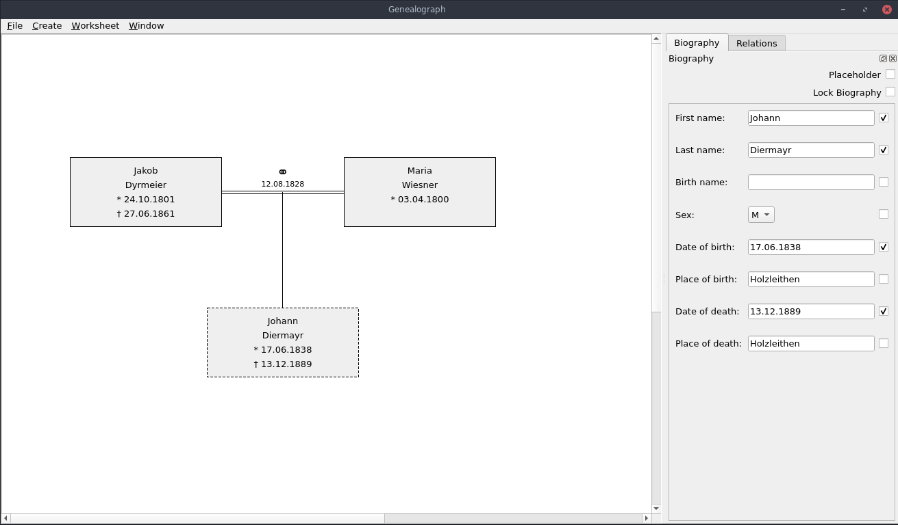

# Genealograph
A Qt-based family tree creator.



## Build
Enter the project directory and run:
```
cmake -S . -B build
make -C build
```
After the building process is finished, the executable can be found in the `build` folder of the project directory.

## Dependencies
- Qt6
- C++17 or later (GCC 7.5 or later, Clang 5 or later)
- CMake 3.16 or later